# 📚 SIAKAD - Sistem Informasi Akademik Desktop

**Aplikasi Manajemen Akademik Terintegrasi Berbasis Java Swing**

[]()
[]()
[]()

## Fitur Utama

- Autentikasi login berbasis role (Admin dan Operator)
- Master Mahasiswa (CRUD) - akses Admin
- Master Dosen (CRUD) - akses Admin
- Master Mata Kuliah (CRUD) - akses Admin
- Setting User (tambah user) - akses Admin
- Transaksi KRS - akses Operator
- Transaksi Nilai - akses Operator
- Ganti Password - akses Admin dan Operator

## Hak Akses Pengguna

### Admin

- Dashboard
- Master Mahasiswa
- Master Dosen
- Master Mata Kuliah
- Setting User
- Ganti Password (dapat mengelola semua akun)

### Operator

- Dashboard
- Transaksi KRS
- Transaksi Nilai
- Ganti Password (akun sendiri saja)

## Screenshot Aplikasi

### Layar Login
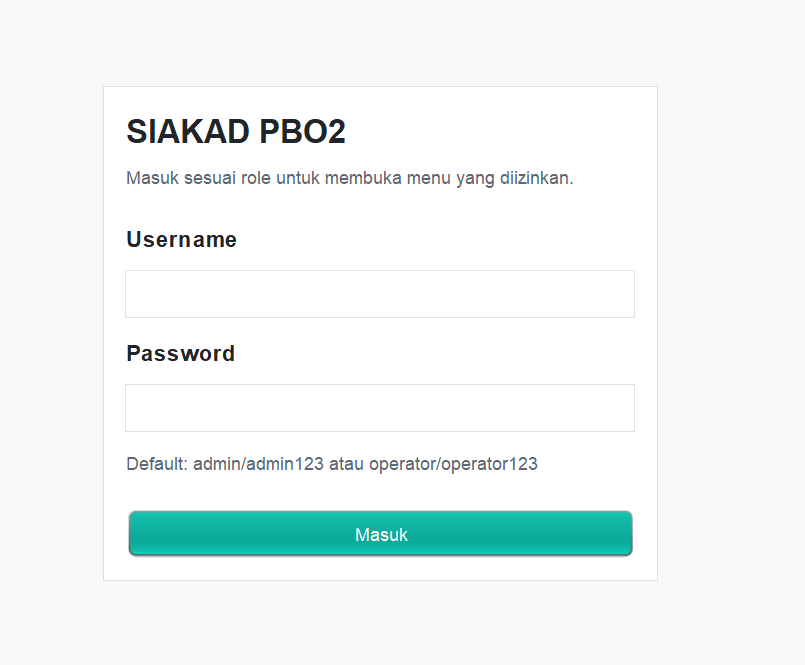

*Akses: Admin & Operator*

### Dashboard Admin
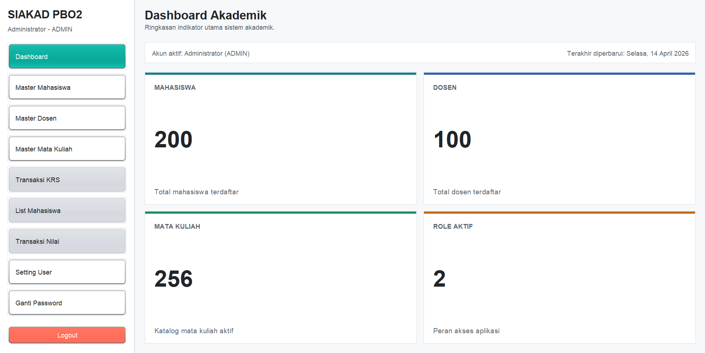

*Akses: Admin*

### Modul Master Mahasiswa
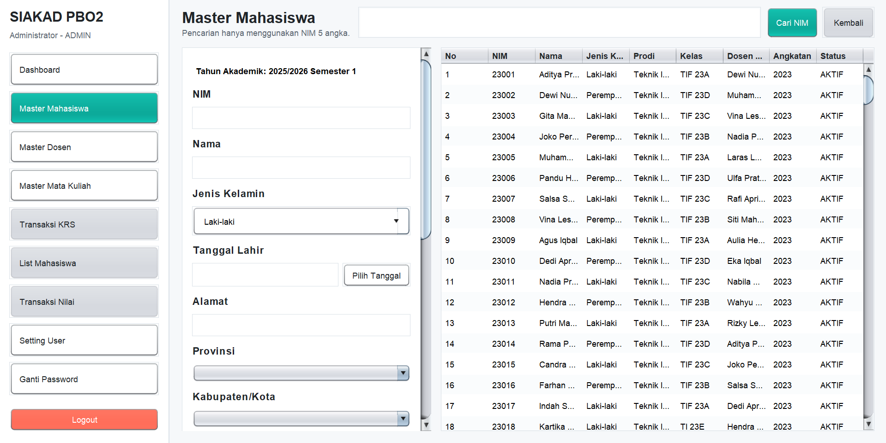

*Akses: Admin*

### Modul Master Dosen
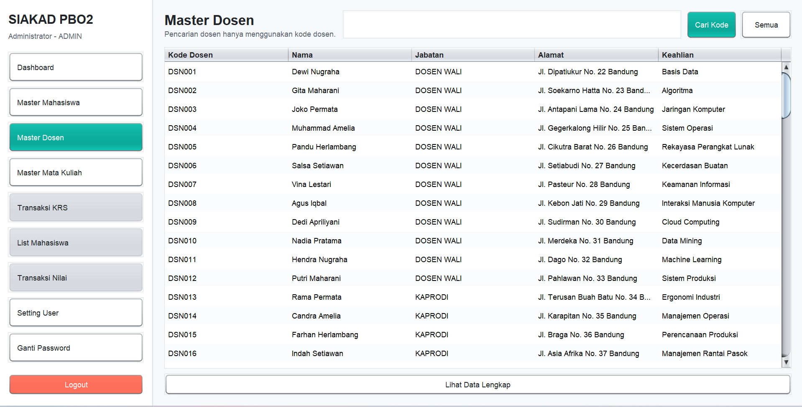

*Akses: Admin*

### Modul Master Mata Kuliah
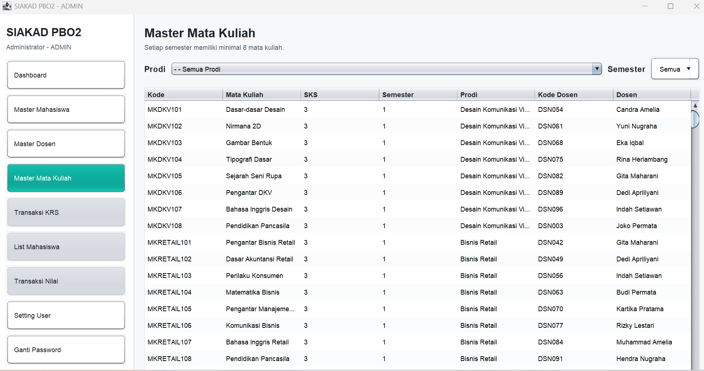

*Akses: Admin*

### Modul Ganti Password
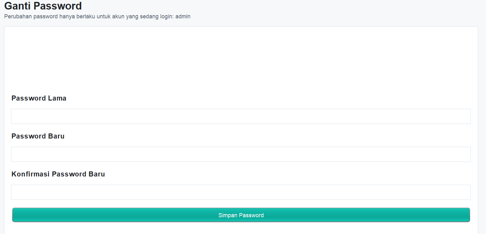

*Akses: Admin (semua akun), Operator (akun sendiri saja)*

### Transaksi KRS
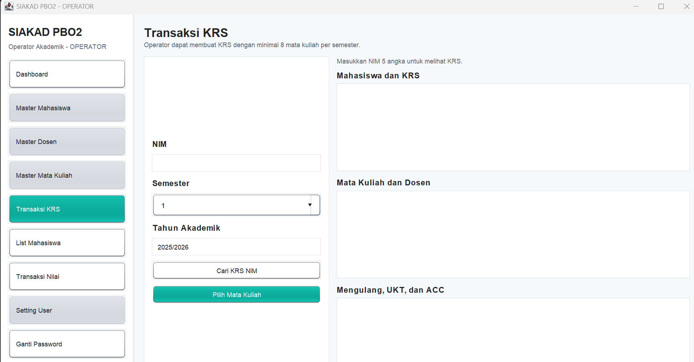

*Akses: Operator*

### Transaksi Nilai
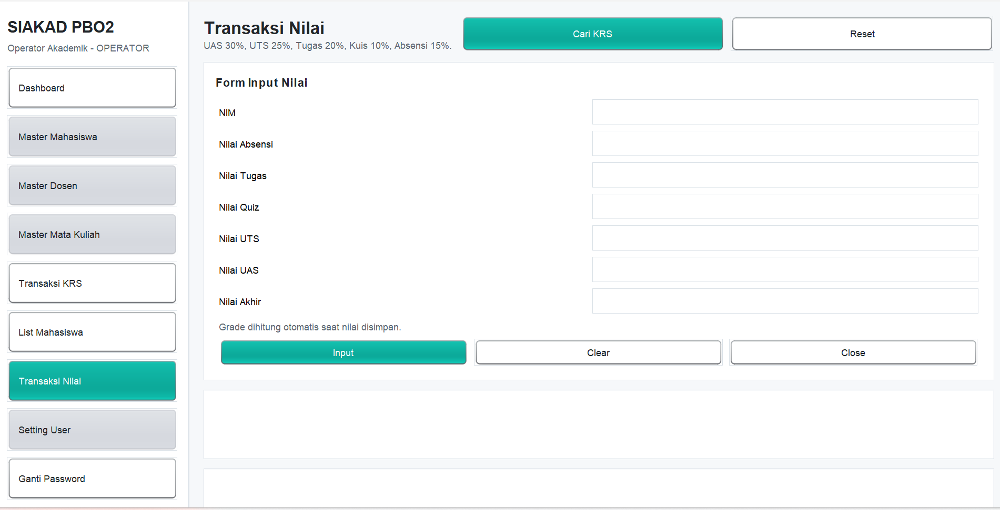

*Akses: Operator*

### Ringkasan Akses Fitur

| Fitur | Admin | Operator |
|------|:-----:|:--------:|
| Dashboard | Ya | Ya |
| Master Mahasiswa | Ya | Tidak |
| Master Dosen | Ya | Tidak |
| Master Mata Kuliah | Ya | Tidak |
| Setting User | Ya | Tidak |
| Transaksi KRS | Tidak | Ya |
| Transaksi Nilai | Tidak | Ya |
| Ganti Password | Ya | Ya |

---

## Use Case & Alur Kerja Aplikasi

### 📋 Use Case Diagram

Diagram berikut menunjukkan semua use case dalam sistem SIAKAD dan interaksi antara aktor (Admin/Operator) dengan sistem:

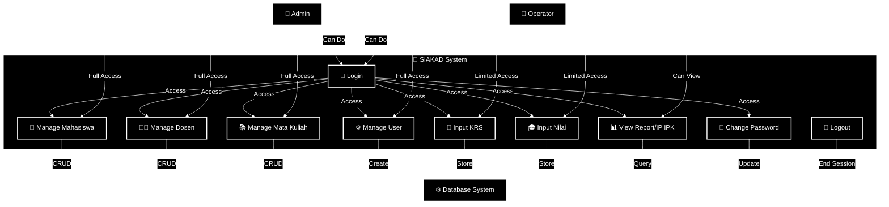

**Penjelasan:**
- 👤 **Admin**: Akses penuh ke semua modul master data
- 👥 **Operator**: Akses terbatas ke transaksi KRS dan Nilai saja
- ⚙️ **Database System**: Backend yang menyimpan dan mengelola data

---

### 🔀 Activity Flow Diagram

Diagram berikut menunjukkan alur lengkap dari saat aplikasi dijalankan hingga ditutup:

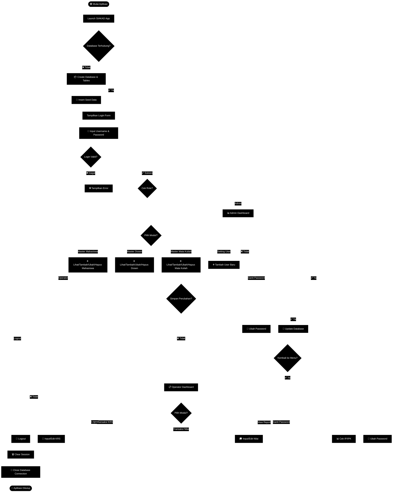

**Alur Utama:**
1. 🟢 **Launch**: Aplikasi dimulai dan check koneksi database
2. 📦 **Setup**: Jika database belum ada, sistem auto-create dengan seed data
3. 🔐 **Login**: User memasukkan credentials
4. ✅ **Validasi**: Sistem validasi login dan cek role
5. 📊 **Dashboard**: Menampilkan menu sesuai role (Admin/Operator)
6. 🔄 **Operasi**: User memilih modul dan melakukan CRUD/Transaksi
7. 💾 **Simpan**: Perubahan disimpan ke database
8. 👋 **Logout**: Session berakhir dan koneksi ditutup

---

### 🔗 Sequence Diagram - Transaksi KRS (Admin & Operator)

Diagram berikut menunjukkan interaksi detail antara **Admin** dan **Operator** saat melakukan transaksi KRS:

```mermaid
%%{init: {'theme': 'base', 'themeVariables': { 'background': '#000000', 'lineColor': '#FFFFFF', 'textColor': '#FFFFFF', 'primaryTextColor': '#FFFFFF', 'secondaryTextColor': '#FFFFFF', 'tertiaryTextColor': '#FFFFFF', 'actorBkg': '#000000', 'actorBorder': '#FFFFFF', 'actorTextColor': '#FFFFFF', 'actorLineColor': '#FFFFFF', 'signalColor': '#FFFFFF', 'signalTextColor': '#FFFFFF', 'labelBoxBkgColor': '#000000', 'labelBoxBorderColor': '#FFFFFF', 'labelTextColor': '#FFFFFF', 'noteBkgColor': '#000000', 'noteBorderColor': '#FFFFFF', 'noteTextColor': '#FFFFFF', 'activationBkgColor': '#000000', 'activationBorderColor': '#FFFFFF' }}}%%
sequenceDiagram
    actor Admin as 👨‍💼 Admin
    actor Operator as 👤 Operator
    participant UI as 🖥️ KRS Panel
    participant Service as 📋 LayananAkademik
    participant DB as 💾 Database
    
    Operator ->> UI: 1. Buka Input KRS
    UI ->> Service: 2. Ambil daftar mahasiswa
    Service ->> DB: 3. Query mahasiswa
    DB -->> Service: ◀️ Data mahasiswa
    Service -->> UI: ◀️ List mahasiswa
    UI -->> Operator: ◀️ Tampilkan form
    
    rect rgb(20, 20, 20)
        Note over Operator,UI: Operator: Pilih Mahasiswa & Paket KRS
        Operator ->> UI: 4. Pilih mahasiswa + semester
        UI ->> Service: 5. Ambil mata kuliah semester {N}
        Service ->> DB: 6. Query mk by semester
        DB -->> Service: ◀️ 8 mata kuliah
        Service -->> UI: ◀️ Daftar mata kuliah
        UI -->> Operator: ◀️ Preview KRS
    end
    
    rect rgb(20, 20, 20)
        Note over Operator,DB: Operator: Validasi & Simpan KRS
        Operator ->> UI: 7. Klik "Simpan KRS"
        UI ->> Service: 8. Validate data (SKS, kapasitas, dll)
        Service ->> DB: 9. Check existing KRS
        DB -->> Service: ◀️ Check result
        alt Validasi Gagal
            Service -->> UI: ❌ Error message
            UI -->> Operator: ◀️ Tampilkan error
        else Validasi Sukses
            Service ->> DB: 10. Insert KRS records
            DB -->> Service: ✅ Success
            Service ->> DB: 11. Calculate IP otomatis
            DB -->> Service: ✅ IP updated
            Service -->> UI: ✅ Simpan berhasil
            UI -->> Operator: ◀️ Refresh list
        end
    end
    
    rect rgb(20, 20, 20)
        Note over Admin,DB: Admin: Review & Approval
        Admin ->> UI: 12. View pending KRS
        UI ->> Service: 13. Get KRS awaiting approval
        Service ->> DB: 14. Query KRS status
        DB -->> Service: ◀️ List KRS pending
        Service -->> UI: ◀️ Display KRS
        UI -->> Admin: ◀️ Tampilkan KRS untuk approval
        Admin ->> UI: 15. Approve/Reject KRS
        UI ->> Service: 16. Update status KRS
        Service ->> DB: 17. Update ACC field
        DB -->> Service: ✅ Updated
        Service -->> UI: ✅ Status updated
        UI -->> Admin: ◀️ Confirmation
    end
    
    Operator ->> UI: 18. Kembali ke menu
    UI -->> Operator: ◀️ Back to Operator Dashboard
```

**Penjelasan Alur:**

| # | Actor | Deskripsi |
|---|-------|-----------|
| **1-11** | 👤 **Operator** | Input KRS: pilih mahasiswa, ambil MK per semester, validasi, simpan ke DB |
| **12-17** | 👨‍💼 **Admin** | Review & Approval: lihat KRS pending, review, approve/reject, update status ACC |
| **18** | 👤 **Operator** | Kembali ke dashboard setelah selesai |

**Catatan Tampilan:**
- Diagram diset **monokrom hitam-putih** agar kontras di tema gelap.

---

## 🏗️ Arsitektur Sistem

### Struktur Folder

```
UTS_PBO2/
├── src/main/java/id/ac/utb/pbo2/
│   ├── Aplikasi.java                    # Entry point aplikasi
│   ├── DatabaseCheck.java               # Validasi database
│   ├── config/
│   │   └── AppConfig.java               # Konfigurasi aplikasi
│   ├── db/
│   │   ├── BasisData.java               # Koneksi database
│   │   └── DatabaseBootstrap.java       # Inisialisasi database
│   ├── model/
│   │   └── PenggunaSaatIni.java         # Model user session
│   ├── service/
│   │   ├── LayananAkademik.java         # Business logic akademik
│   │   └── LayananOtentikasi.java       # Autentikasi & validasi
│   ├── ui/
│   │   ├── LoginFrame.java              # Form login
│   │   ├── MainFrame.java               # Window utama
│   │   ├── DashboardPanel.java          # Dashboard awal
│   │   ├── MahasiswaPanel.java          # Master mahasiswa
│   │   ├── DosenPanel.java              # Master dosen
│   │   ├── MataKuliahPanel.java         # Master mata kuliah
│   │   ├── UserPanel.java               # Setting user
│   │   ├── KrsPanel.java                # Transaksi KRS
│   │   ├── NilaiPanel.java              # Transaksi nilai
│   │   ├── PasswordPanel.java           # Ubah password
│   │   ├── DatePickerField.java         # Custom date picker
│   │   ├── YearPickerField.java         # Custom year picker
│   │   ├── StudentListPanel.java        # List view mahasiswa
│   │   └── Theme.java                   # UI theme & styling
│   └── util/
│       └── PasswordUtil.java            # Utility enkrip password
├── database/
│   ├── uts_pbo2.sql                     # Schema & seed data
│   └── wilayah_indonesia.sql            # Data wilayah (optional)
├── scripts/
│   ├── build.bat                        # Build script
│   └── run.bat                          # Run script
├── lib/
│   └── mysql-connector-j-8.4.0.jar      # JDBC driver
├── pom.xml                              # Maven configuration
└── README.md                            # Dokumentasi ini
```

### Technology Stack

```
┌─────────────────────────────────────┐
│   Java Swing UI (AWT/Swing)        │
│   (LoginFrame, MainFrame, Panels)  │
└──────────────┬──────────────────────┘
               │
┌──────────────▼──────────────────────┐
│   Business Logic Layer              │
│   (LayananAkademik, Validasi, etc) │
└──────────────┬──────────────────────┘
               │
┌──────────────▼──────────────────────┐
│   Database Abstraction              │
│   (BasisData, JDBC Connection)     │
└──────────────┬──────────────────────┘
               │
┌──────────────▼──────────────────────┐
│   MySQL/MariaDB Database            │
│   (uts_pbo2 Schema)                │
└─────────────────────────────────────┘
```

---

## ✅ Validasi & Business Rules

### Validasi Input
- 📏 **NIM**: Wajib 5 digit angka
- 👥 **Prodi**: Hanya `Teknik Informatika`, `Teknik Industri`, `DKV`, `RETAIL`
- 🏷️ **Kode Kelas**: Otomatis mengikuti prodi (TIF, TI, DKV, RETAIL)
- 📅 **Format Tahun**: Popup kalender untuk pilih angkatan
- 🔒 **Status Mahasiswa**: Otomatis AKTIF saat tambah data
- 📝 **Password**: Terenkripsi dengan secure hashing
- ✅ **Error Messages**:
  - "Maaf minimal input angka adalah 5." (NIM < 5 digit)
  - "Maaf data tersebut tidak ada." (NIM valid tapi tidak ditemukan)

### Business Logic
- 🔍 Pencarian mahasiswa **hanya** berdasarkan NIM
- 🔄 Tombol `Kembali` di Master Mahasiswa untuk reset tampilan semua data
- 📝 Format kelas detail: `TIF 25A CID`, `DKV 24C`, `TI 21F`
- 📊 Konversi nilai: A(4.0), B(3.0), C(2.0), D(1.0), E(0.0)
- 🎓 IP = rata-rata nilai semester berlaku
- 📈 IPK = rata-rata nilai kumulatif dari semua semester
- 🔄 **KRS Mengulang**: Otomatis ditandai jika mahasiswa pernah ambil mata kuliah yang sama

### Advanced Features
- 💰 **UKT Integration**: KRS otomatis disetujui jika UKT semester lunas
- 👨‍🏫 **Approval Workflow**: ACC dosen wali + dosen prodi
- 📋 **Semester Filter**: Master Mata Kuliah auto-filter saat semester dipilih
- 📦 **Bulk Enroll**: Tambah paket KRS otomatis memasukkan 8 mata kuliah sesuai semester
- 📊 **KRS Table Divided**: Tiga section - Mahasiswa/KRS, Mata Kuliah/Dosen, Mengulang/UKT/ACC

### Data Integrity
- ✅ Primary Key: Mencegah duplikasi
- ✅ Unique Key: Validasi unikitas kolom penting
- ✅ Validasi Aplikasi: Double-check di layer business logic
- ✅ View IPK: Snapshot dari KRS + Nilai tanpa duplikasi

---

## 📊 Data Seed & Statistik

**Bawaan Database (siap pakai):**
- 👥 **24 Mahasiswa** - Bervariasi dengan UKT lunas/belum lunas
- 👨‍🏫 **16 Dosen** - Sebagai pengampu dan wali kelas
- 📚 **64 Mata Kuliah** - 8 per semester (semester 1-8)
- 4️⃣ **4 Program Studi** - TIF, TI, DKV, RETAIL
- 📋 **199 Data KRS** - Termasuk data mengulang
- 🎓 **199 Nilai** - Sesuai dengan KRS
- 💳 **48 Pembayaran UKT** - Bervariasi lunas/belum

---

## 🔧 Troubleshooting

| Masalah | Solusi |
|---------|--------|
| **"JDK tidak ditemukan"** | Pastikan JAVA_HOME diset atau javac di PATH |
| **"Connection refused"** | Pastikan MySQL/MariaDB running di XAMPP |
| **"Database not found"** | Jalankan aplikasi sekali - database auto-created |
| **"Port 3306 sudah in-use"** | Ubah DB_PORT di environment variable |
| **"GUI tidak merespons"** | Increase heap size: `set JAVA_OPTS=-Xmx1024m` |

### Verifikasi Database

Jalankan command berikut untuk memverifikasi seed data:

```batch
scripts\build.bat
```

Kemudian:

```batch
java -cp "target\classes;lib\mysql-connector-j-8.4.0.jar" id.ac.utb.pbo2.DatabaseCheck
```

**Expected Output:**
```
mahasiswa=24
dosen=16
prodi=4
matakuliah=64
pembayaran_ukt=48
krs=199
nilai=199
matakuliah_semester_1=8
matakuliah_semester_2=8
...
matakuliah_semester_8=8
```

---

## 📞 Support & Kontribusi

Untuk laporan bug atau saran fitur, silakan buat issue atau hubungi tim development.

Kontak: `6281818266692`

---

## 📄 Lisensi

Project ini dikembangkan sebagai tugas **UTS PBO2** dengan referensi pada best practices enterprise Java applications.

---

**Last Updated:** April 2026
**Version:** 1.0.0


